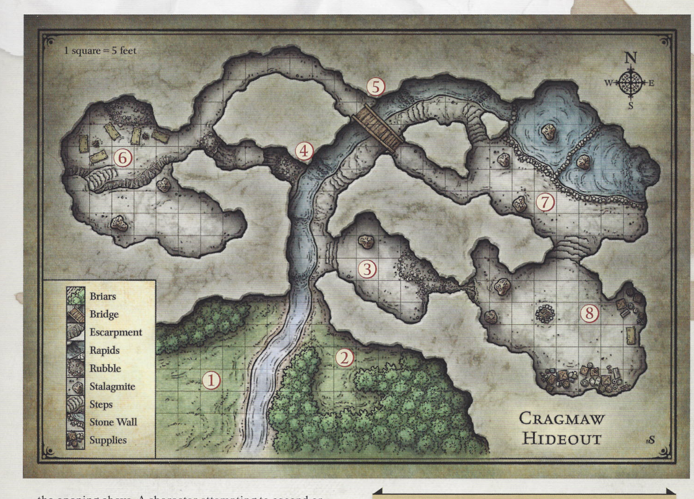

# D&D Module Converter

Convert official D&D PDFs into FoundryVTT content. Uses Google Gemini AI to extract chapters, stat blocks, NPCs, maps, and scenes into structured data, then uploads complete journal entries, actors, and scenes to FoundryVTT.

## Features

### PDF Processing Pipeline
- **PDF to Journal** - Extract chapter text, formatting, tables, and boxed text into FoundryVTT journal entries
- **Actor Extraction** - Parse stat blocks into complete FoundryVTT actors with attacks, spells, and abilities
- **Map Extraction** - Automatically detect and extract battle maps from PDF pages
- **Scene Artwork** - Generate AI artwork for locations described in the module

### Scene Creation
- **Wall Detection** - AI-powered wall detection for battle maps
- **Grid Detection** - Automatic grid size detection for battle maps
- **Scene Upload** - Create FoundryVTT scenes with walls and proper grid settings

### Chat Interface (Tablewrite Module)
Natural language interface directly in FoundryVTT with 12 tools:

| Tool | Description |
|------|-------------|
| `create_actor` | Create a D&D actor from natural language description |
| `batch_create_actors` | Create multiple actors at once |
| `edit_actor` | Modify an existing actor's properties |
| `create_journal` | Create a journal entry |
| `edit_journal` | Modify an existing journal's name, content, or pages |
| `create_scene` | Create a scene from a battle map image |
| `generate_images` | Generate D&D scene artwork via AI |
| `delete_assets` | Delete actors, journals, or scenes |
| `query_journal` | Ask questions about journal content, get summaries |
| `list_actors` | List all actors in the world with clickable links |
| `list_scenes` | List all scenes in the world with clickable links |
| `help` | List all available tools and commands |

### Additional Features
- **Rules Q&A** - Ask D&D rules questions with extended thinking mode
- **2014/2024 Rules Support** - Automatically detects your dnd5e rules version
- **Foundry v12-v13 Compatible** - Works with both Foundry versions

## Setup

### Prerequisites

- Google Gemini API key
- FoundryVTT v12+ running locally or on The Forge
- Docker (recommended) or Python 3.11+ with [uv](https://github.com/astral-sh/uv)

### Option 1: Docker Installation (Recommended)

The easiest way to get started. No Python installation required.

#### 1. Configure Environment

Create a `.env` file:

```bash
# Required
GeminiImageAPI=your_gemini_api_key
FOUNDRY_URL=http://host.docker.internal:30000  # Use this for local Foundry

# For Foundry on a different machine
FOUNDRY_URL=http://192.168.1.100:30000
```

#### 2. Build and Run

```bash
# Using docker-compose (recommended)
docker-compose -f docker-compose.tablewrite.yml up -d

# Or build manually
docker build -t tablewrite .
docker run -d -p 8000:8000 --env-file .env -v ./data:/app/data -v ./output:/app/output tablewrite
```

#### 3. Install FoundryVTT Module

The Tablewrite module must be installed in FoundryVTT to connect to the backend.

**Option A: Download from Releases**
1. Download the latest `tablewrite-assistant.zip` from GitHub releases
2. Extract to your FoundryVTT modules directory:
   - Windows: `%localappdata%/FoundryVTT/Data/modules/`
   - macOS: `~/Library/Application Support/FoundryVTT/Data/modules/`
   - Linux: `~/.local/share/FoundryVTT/Data/modules/`

**Option B: Clone and Copy**
```bash
# Clone repo and copy module
git clone https://github.com/your-repo/dnd_module_gen.git
cp -r dnd_module_gen/foundry-module/tablewrite-assistant \
  "/path/to/FoundryVTT/Data/modules/"
```

#### 4. Enable the Module in Foundry

1. Launch FoundryVTT and open your world
2. Go to **Settings** → **Manage Modules**
3. Find "Tablewrite Assistant" and check the box to enable it
4. Click **Save Module Settings**
5. The page will refresh - look for the feather icon in the sidebar

#### 5. Docker Commands

```bash
# Start
docker-compose -f docker-compose.tablewrite.yml up -d

# View logs
docker-compose -f docker-compose.tablewrite.yml logs -f

# Stop
docker-compose -f docker-compose.tablewrite.yml down

# Rebuild after code changes
docker-compose -f docker-compose.tablewrite.yml up -d --build
```

#### 6. Health Check

```bash
curl http://localhost:8000/health
# Returns: {"status": "healthy"}
```

### Option 2: Local Installation (For Developers)

Use this option if you want to modify the code or run tests.

#### 1. Install Dependencies

```bash
# Install uv (Python package manager)
curl -LsSf https://astral.sh/uv/install.sh | sh

# Clone the repository
git clone https://github.com/your-repo/dnd_module_gen.git
cd dnd_module_gen

# Create virtual environment and install dependencies
uv sync
```

#### 2. Configure Environment

Create a `.env` file in the project root:

```bash
# Required: Gemini API key
GeminiImageAPI=your_gemini_api_key

# Required for FoundryVTT integration
FOUNDRY_URL=http://localhost:30000
```

#### 3. Install FoundryVTT Module

**Option A: Symlink (recommended for development)**
```bash
ln -s "$(pwd)/foundry-module/tablewrite-assistant" \
  "/path/to/FoundryVTT/Data/modules/tablewrite-assistant"
```

**Option B: Copy**
```bash
cp -r foundry-module/tablewrite-assistant \
  "/path/to/FoundryVTT/Data/modules/"
```

#### 4. Enable the Module in Foundry

1. Launch FoundryVTT and open your world
2. Go to **Settings** → **Manage Modules**
3. Find "Tablewrite Assistant" and check the box to enable it
4. Click **Save Module Settings**

#### 5. Start the Backend

```bash
cd ui/backend
uv run uvicorn app.main:app --reload --port 8000
```

#### 6. Connect Foundry

1. Refresh your FoundryVTT world (F5)
2. The Tablewrite module auto-connects to `ws://localhost:8000`
3. Look for the feather icon in the sidebar tabs

### Option 3: The Forge Hosting

If using The Forge for FoundryVTT hosting:

```bash
# .env configuration
FOUNDRY_FORGE_URL=https://your-game.forge-vtt.com
FOUNDRY_FORGE_API_KEY=your_forge_key
FOUNDRY_TARGET=forge
```

## Usage

### Getting Help

In the Foundry chat, type `/help` or ask "what can you do?" to see all available tools:

```
/help
```

Response:
```
**Available Tools:**

- **batch_create_actors**: Create multiple D&D actors from descriptions.
- **create_actor**: Create a D&D actor from a natural language description.
- **create_journal**: Create a journal entry in FoundryVTT.
- **create_scene**: Create a FoundryVTT scene from a battle map image.
- **delete_assets**: Delete actors, journals, or scenes from FoundryVTT.
- **edit_actor**: Edit an existing actor in FoundryVTT.
- **edit_journal**: Edit an existing journal's name, content, or pages.
- **generate_images**: Generate D&D scene artwork using AI.
- **help**: List all available tools and commands.
- **list_actors**: List all actors in the Foundry world with clickable links.
- **list_scenes**: List all scenes in the Foundry world with clickable links.
- **query_journal**: Query journal entries for information, summaries, or answers.

**Slash Commands:**
- `/help` - Show this help
- `/list-actors` - List all actors
- `/list-scenes` - List all scenes
- `/generate-scene [description]` - Generate scene artwork
```

### Chat Examples

**Create an Actor:**
```
Create a goblin shaman with CR 1 that can cast minor illusion and fog cloud
```

**List Actors:**
```
list actors
```
or
```
/list-actors
```

**Query a Journal:**
```
What treasure is in Cragmaw Hideout?
```

**Generate Scene Art:**
```
Generate an image of a dark forest clearing with ancient standing stones
```

**Delete Assets:**
```
Delete all actors named "Test Goblin"
```

### Full PDF Pipeline

Process an entire D&D module PDF:

```bash
# Place your PDF in data/pdfs/, then run:
uv run python scripts/full_pipeline.py --journal-name "Lost Mine of Phandelver"

# Skip specific steps
uv run python scripts/full_pipeline.py --skip-actors    # Skip actor extraction
uv run python scripts/full_pipeline.py --skip-split     # Reuse existing chapters
```

Or use the Module tab in the Foundry chat interface to upload and process PDFs directly.

### Individual Pipeline Steps

```bash
# Split PDF into chapters
uv run python src/pdf_processing/split_pdf.py

# Generate XML from chapters
uv run python src/pdf_processing/pdf_to_xml.py

# Extract maps from PDF
uv run python src/pdf_processing/image_asset_processing/extract_map_assets.py \
  --pdf data/pdfs/module.pdf

# Generate scene artwork
uv run python scripts/generate_scene_art.py --run-dir output/runs/latest

# Upload to FoundryVTT
uv run python src/foundry/upload_journal_to_foundry.py
```

### Python API

```python
from api import create_actor, create_scene, APIError

# Create actor from natural language description
result = create_actor("A cunning kobold scout with a poisoned dagger", challenge_rating=0.5)
print(f"Created: {result.name} - {result.foundry_uuid}")

# Create scene from battle map with automatic wall detection
scene = create_scene("maps/castle.webp", name="Castle Ruins")
print(f"Created scene with {scene.wall_count} walls, grid size {scene.grid_size}px")
```

For PDF processing, use the Module tab UI or CLI scripts directly.

## Configuration

Full `.env` options:

```bash
# Gemini API (required)
GeminiImageAPI=your_api_key

# FoundryVTT Connection (required for upload)
FOUNDRY_URL=http://localhost:30000

# Optional: The Forge hosting
FOUNDRY_FORGE_URL=https://your-game.forge-vtt.com
FOUNDRY_FORGE_API_KEY=your_forge_key
FOUNDRY_TARGET=local  # or "forge"

# Optional: Scene artwork settings
ENABLE_SCENE_ARTWORK=true
IMAGE_STYLE_PROMPT=fantasy illustration, D&D 5e art style

# Optional: Backend URL (for Python API client)
BACKEND_URL=http://localhost:8000
```

## Architecture

```
PDF → Gemini AI → XML → FoundryVTT Entities
                    ↓
    Backend (FastAPI) ←WebSocket→ Foundry Module → FoundryVTT
```

### Components

| Component | Description |
|-----------|-------------|
| `src/` | Core processing library (PDF, actors, scenes, journals) |
| `ui/backend/` | FastAPI backend with WebSocket and chat tools |
| `foundry-module/` | FoundryVTT Tablewrite Assistant module |
| `scripts/` | Pipeline orchestration scripts |

### Data Flow

1. **Batch Pipeline** - Process entire PDFs via CLI: `full_pipeline.py`
2. **Module Tab** - Upload PDFs via Foundry UI for processing
3. **Chat Interface** - Create individual entities via natural language

All paths communicate with FoundryVTT through the backend's WebSocket connection.

## Project Structure

```
src/
├── api.py                    # Public API (create_actor, create_scene)
├── config.py                 # Centralized configuration
├── exceptions.py             # Custom exceptions
├── caches/                   # SpellCache, IconCache
├── actor_pipeline/           # Actor creation from descriptions
├── pdf_processing/           # PDF splitting, XML generation, map extraction
├── scenes/                   # Scene creation with wall/grid detection
├── foundry/                  # FoundryVTT client and upload
├── foundry_converters/       # Data conversion (actors, journals)
├── models/                   # Core data models (XMLDocument, Journal)
└── wall_detection/           # AI wall detection for battle maps

ui/backend/
├── app/
│   ├── main.py               # FastAPI application
│   ├── routers/              # API endpoints (chat, actors, scenes, journals)
│   ├── tools/                # Chat tools (12 registered tools)
│   ├── services/             # Gemini service, command parser
│   └── websocket/            # WebSocket connection to Foundry
└── tests/                    # Backend tests

foundry-module/tablewrite-assistant/
├── src/                      # TypeScript source
├── dist/                     # Compiled JavaScript
├── styles/                   # CSS
└── lang/                     # Localization

scripts/                      # Pipeline orchestration
output/runs/                  # Timestamped output directories
```

## Testing

```bash
# Smoke tests (fast, ~1 min, 25 tests)
uv run pytest

# Full test suite (~600 tests, requires backend + Foundry running)
uv run pytest --full

# Parallel execution (fastest)
uv run pytest --full -n auto --dist loadscope

# Unit tests only (no API calls)
uv run pytest -m "not integration and not slow"

# Docker tests (no Foundry required)
docker build --target test -t tablewrite-test .
docker run tablewrite-test
```

## Troubleshooting

**Backend won't start**
```bash
# Check if port 8000 is in use
lsof -i :8000
# Kill existing process
lsof -ti :8000 | xargs kill -9
```

**Foundry module not connecting**
1. Ensure backend is running on port 8000
2. Check Foundry console (F12) for WebSocket errors
3. Verify module is enabled in your world
4. For v13: Refresh the page after enabling the module

**Tablewrite tab not appearing**
```bash
# Rebuild the TypeScript (if using symlink)
cd foundry-module/tablewrite-assistant
npm run build
# Then refresh Foundry (F5)
```

**Map extraction fails**
- Ensure PDF has embedded images (not scanned/flattened)
- Check `output/runs/<timestamp>/map_assets/` for debug images

**Actor creation times out**
- Actor creation takes 10-30 seconds (Gemini API calls)
- Check backend logs: `docker-compose logs -f` or terminal output

**Docker: Foundry connection refused**
- Use `host.docker.internal` instead of `localhost` in FOUNDRY_URL
- Ensure Foundry is accessible from the Docker network

## Example Output

### Map Extraction
Battle maps are automatically detected and extracted from PDF pages:



### Wall Detection
AI detects walls in battle maps and exports them for FoundryVTT scenes:

| Original | AI Wall Detection |
|----------|-------------------|
|  |  |

### Scene Artwork
AI-generated artwork for locations in the module:


## Requirements

- Python 3.11+
- [uv](https://github.com/astral-sh/uv) package manager
- Google Gemini API key
- FoundryVTT v12+ with Tablewrite Assistant module
- Docker (optional, for containerized deployment)

## License

MIT
