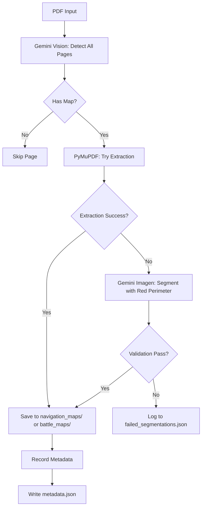

# Image Asset Extraction Design

**Date**: 2025-10-26
**Status**: Approved Design
**Author**: Claude Code (with user collaboration)

## Overview

A standalone tool for extracting map images (navigation maps and battle maps) from D&D module PDFs using AI-powered detection and hybrid extraction techniques.

## Goals

- **High recall**: Find all navigation and battle maps (99%+ accuracy)
- **Standalone operation**: Independent script, not integrated into main pipeline
- **Hybrid extraction**: Try direct PDF extraction first, fall back to AI segmentation for baked-in images
- **Rich metadata**: Capture map name, chapter, page number, type, and extraction method
- **Storage for future use**: Archive images for eventual FoundryVTT upload

## Non-Goals

- Automatic upload to FoundryVTT (future enhancement)
- Other asset types beyond navigation/battle maps (portraits, item art, etc.)
- Real-time processing or streaming
- Manual bounding box annotation UI

## Architecture

### High-Level Workflow

```
PDF Input
    ↓
[1] Async Gemini Vision Detection (all pages in parallel)
    ↓
[2] PyMuPDF Extraction (for detected maps)
    ↓
[3] Gemini Imagen Segmentation (fallback for baked-in images)
    ↓
Organized Output (by map type) + metadata.json
```

### Module Structure

```
src/pdf_processing/image_asset_processing/
├── __init__.py
├── extract_map_assets.py      # Main orchestration script
├── validate_segmentation.py   # Standalone validation tool
├── models.py                  # Pydantic data models
├── detect_maps.py             # Gemini Vision detection
├── extract_maps.py            # PyMuPDF extraction
└── segment_maps.py            # Gemini Imagen segmentation
```

### Output Structure

```
output/image_assets/
├── navigation_maps/
│   ├── cragmaw_hideout_p05.png
│   └── phandalin_overview_p12.png
├── battle_maps/
│   ├── redbrand_hideout_p08.png
│   └── wave_echo_cave_p22.png
├── metadata.json
├── failed_segmentations.json  # Only if failures occur
└── extraction.log
```

## Component Details

### 1. Gemini Vision Detection (`detect_maps.py`)

**Purpose**: Identify which pages contain maps and classify them.

**Implementation**:
- Model: `gemini-2.0-flash` (fast, cost-effective for classification)
- Async processing: `asyncio.gather()` processes all pages in parallel
- Structured output using Pydantic

**Prompt Template**:
```
Analyze this D&D module page. Does it contain a navigation map (dungeon/wilderness overview)
or battle map (tactical grid/encounter area)?

If yes, provide:
1. type: "navigation_map" or "battle_map"
2. name: descriptive name (3 words max, e.g., "Cragmaw Hideout", "Wave Echo Cave")

Ignore: character portraits, item illustrations, decorative art.
```

**Return Type**:
```python
class MapDetectionResult(BaseModel):
    has_map: bool
    type: Optional[str]  # "navigation_map" or "battle_map"
    name: Optional[str]  # 3 words max
```

**Error Handling**:
- 3 retries with exponential backoff (consistent with `pdf_to_xml.py`)
- Failures logged, processing continues (high recall priority)

### 2. PyMuPDF Extraction (`extract_maps.py`)

**Purpose**: Extract images directly from PDF structure when possible.

**Implementation**:
```python
def extract_image_with_pymupdf(page, output_path: str) -> bool:
    """
    Extract embedded images from PDF page.
    Returns True if extraction succeeded, False otherwise.
    """
    # 1. Get all images on page
    images = page.get_images()

    # 2. Filter for large images (>25% page area)
    page_area = page.rect.width * page.rect.height
    threshold = page_area * 0.25

    for img in images:
        xref = img[0]
        img_info = doc.extract_image(xref)

        if img_info['width'] * img_info['height'] > threshold:
            # 3. Save image
            save_png(img_info['image'], output_path)
            return True

    return False
```

**Rationale**:
- Fast (<100ms per page)
- Preserves original image quality
- Deterministic (no retries needed)

### 3. Gemini Imagen Segmentation (`segment_maps.py`)

**Purpose**: Extract baked-in maps using AI image generation and red perimeter technique.

**Implementation**:
```python
def segment_with_imagen(page_image: bytes, map_type: str, output_path: str) -> None:
    """
    Segment baked-in map using red perimeter technique.
    Raises SegmentationError if validation fails.
    """
    # 1. Generate image with red perimeter
    prompt = f"Add a precise 5-pixel red border (RGB 255,0,0) around the {map_type.replace('_', ' ')} in this image. Do not modify anything else."
    generated_image = generate_with_gemini_imagen(page_image, prompt)

    # 2. Validate red pixels
    red_pixels = detect_red_pixels(generated_image)
    if len(red_pixels) < 100:
        raise SegmentationError(f"Insufficient red pixels: {len(red_pixels)}")

    # 3. Calculate bounding box
    bbox = calculate_bounding_box(red_pixels)
    if bbox_area(bbox) < 1000:
        raise SegmentationError(f"Bounding box too small: {bbox}")

    # 4. Crop (inset 5px to remove red border) and save
    cropped = crop_image(generated_image, bbox, inset=5)
    save_image(cropped, output_path)
```

**Red Pixel Detection**:
```python
def detect_red_pixels(image):
    img_array = np.array(image)
    red_mask = (img_array[:,:,0] == 255) & (img_array[:,:,1] == 0) & (img_array[:,:,2] == 0)
    return np.where(red_mask)
```

**Error Handling**:
- 2 retries (image generation is expensive)
- Raises `SegmentationError` if validation fails
- Failures logged to `failed_segmentations.json`

### 4. Validation Tool (`validate_segmentation.py`)

**Purpose**: Standalone tool for testing segmentation technique before running full pipeline.

**Usage**:
```bash
uv run python src/pdf_processing/image_asset_processing/validate_segmentation.py \
    --pdf data/pdfs/test.pdf --pages 5 12 18
```

**Output**:
```
Page 5: ✓ PASSED
  Red pixels detected: 1247
  Bounding box: (120, 85, 650, 420)

Page 12: ✗ FAILED
  Red pixels detected: 23
  Bounding box: None
  Error: Insufficient red pixels
```

### 5. Main Orchestration (`extract_map_assets.py`)

**Workflow**:
1. Async detection of all pages
2. For each detected map:
   - Try PyMuPDF extraction
   - Fall back to Imagen segmentation if extraction fails
   - Save to appropriate folder with sanitized filename
   - Record metadata
3. Write `metadata.json` and `failed_segmentations.json`

**Metadata Schema**:
```python
class MapMetadata(BaseModel):
    name: str                # "Cragmaw Hideout"
    chapter: Optional[str]   # "Chapter 1" or null
    page_num: int           # 5
    type: str               # "navigation_map" or "battle_map"
    source: str             # "extracted" or "segmented"
```

**CLI Interface**:
```python
parser.add_argument("--pdf", required=True, help="Path to PDF file")
parser.add_argument("--chapter", help="Chapter name (optional)")
parser.add_argument("--output-dir", default="output/image_assets")
```

## Data Flow



## Error Handling

### Detection Phase
- **Failures**: Log warning, continue with remaining pages
- **Rationale**: High recall priority - don't stop entire process for one page

### Extraction Phase
- **Failures**: Expected behavior, fall through to segmentation
- **No retries**: Deterministic operation

### Segmentation Phase
- **Validation failures**: Raise `SegmentationError`
- **Logged to**: `failed_segmentations.json`
- **Continue processing**: Don't halt entire pipeline
- **Retries**: 2 attempts (expensive operation)

### Logging
- Uses centralized `logging_config.py` pattern
- Output: `output/image_assets/extraction.log`
- Levels: DEBUG (API calls), INFO (progress), WARNING (fallbacks), ERROR (failures)

## Performance Expectations

| Operation | Time per Page | Notes |
|-----------|--------------|-------|
| Gemini Vision Detection | ~2-3s for 50 pages | Async parallel processing |
| PyMuPDF Extraction | <100ms | Fast, deterministic |
| Imagen Segmentation | 3-5s | Slow, only for baked-in maps |

**Typical chapter** (50 pages, 3 maps):
- Detection: ~2-3 seconds (all pages in parallel)
- Extraction: ~150ms (3 maps × 50ms)
- Segmentation: ~0-15 seconds (0-3 baked-in maps × 5s)
- **Total**: ~5-20 seconds

## Dependencies

### Existing
- `google-generativeai` - Gemini Vision and Imagen
- `PyMuPDF` (fitz) - PDF and image extraction
- `Pillow` - Image manipulation
- `python-dotenv` - Environment configuration

### New
- `aiohttp` - Async HTTP for Gemini API calls
- `opencv-python` - Red pixel detection and image processing

## Testing Strategy

### Test Structure
```
tests/pdf_processing/image_asset_processing/
├── test_detect_maps.py           # Integration tests (real API)
├── test_extract_maps.py          # Unit tests (no API)
├── test_segment_maps.py          # Integration tests (real API)
└── test_extract_map_assets.py    # End-to-end tests (real API)
```

### Test Markers
- `@pytest.mark.unit` - PyMuPDF tests (fast, no API)
- `@pytest.mark.integration` - Gemini tests (slow, real API calls)
- `@pytest.mark.slow` - Full pipeline tests

### Test Fixtures
- Small test PDF with known maps at specific pages
- Expected outputs for comparison
- Mock API responses for unit tests (where applicable)

## Usage Examples

### Extract from single chapter PDF
```bash
uv run python src/pdf_processing/image_asset_processing/extract_map_assets.py \
    --pdf data/pdf_sections/Lost_Mine_of_Phandelver/01_Introduction.pdf \
    --chapter "Chapter 1"
```

### Extract from full PDF (no chapter metadata)
```bash
uv run python src/pdf_processing/image_asset_processing/extract_map_assets.py \
    --pdf data/pdfs/Lost_Mine_of_Phandelver.pdf
```

### Validate segmentation technique first
```bash
uv run python src/pdf_processing/image_asset_processing/validate_segmentation.py \
    --pdf data/pdfs/test.pdf --pages 5 12 18
```

### Custom output directory
```bash
uv run python src/pdf_processing/image_asset_processing/extract_map_assets.py \
    --pdf data/pdfs/test.pdf \
    --output-dir custom_output/maps/
```

## Future Enhancements

1. **FoundryVTT Integration**: Automatic upload of extracted maps to journal entries or scene backgrounds
2. **Additional Asset Types**: Portraits, item illustrations, handouts
3. **Batch Processing**: Process all chapter PDFs in one command
4. **Interactive Review**: Web UI for reviewing and correcting detections before saving
5. **Compendium Integration**: Link extracted maps to corresponding scenes/locations in FoundryVTT compendium
6. **Quality Assessment**: AI-powered quality scoring for extracted images (blur detection, resolution check)

## Open Questions / Risks

### Red Perimeter Technique Validation
**Risk**: Gemini Imagen may not reliably add red perimeters for segmentation.

**Mitigation**:
- Separate validation tool (`validate_segmentation.py`) for testing before running full pipeline
- Self-validating `segment_with_imagen()` raises errors on invalid output
- Failures logged to `failed_segmentations.json` for manual review
- If technique proves unreliable, fallback options include:
  - Direct bounding box coordinate extraction via Gemini Vision
  - Manual annotation UI for failed cases
  - Alternative segmentation models (SAM, GroundingDINO)

### Cost Considerations
**Concern**: Full PDF processing could be expensive with Gemini API calls.

**Current Approach**:
- Use cost-effective `gemini-2.0-flash` for detection
- Only use expensive Imagen for baked-in maps (minority of cases)
- Async processing maximizes throughput

**Estimated Cost** (Lost Mine of Phandelver):
- 64 pages × $0.0001/page (Vision) = ~$0.006
- ~5 baked-in maps × $0.01/image (Imagen) = ~$0.05
- **Total**: ~$0.056 per module

## Success Metrics

- **Recall**: Finds 95%+ of navigation and battle maps
- **Precision**: 90%+ of extracted images are valid maps (not decorative art)
- **Speed**: Processes typical chapter (<50 pages) in <30 seconds
- **Reliability**: <10% of maps require manual fallback from segmentation failures

## Related Documents

- [Scene Extraction and Artwork Design](./2025-10-23-scene-extraction-and-artwork.md) - Similar AI-powered extraction workflow
- [Foundry Journal Upload Design](./2025-10-16-foundry-journal-upload.md) - Future integration point for map uploads
- `CLAUDE.md` - Project conventions and architecture patterns
